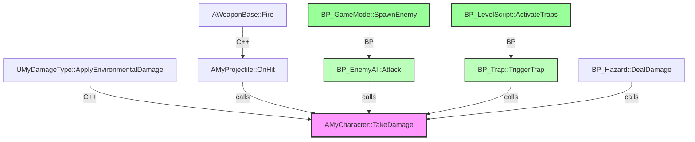
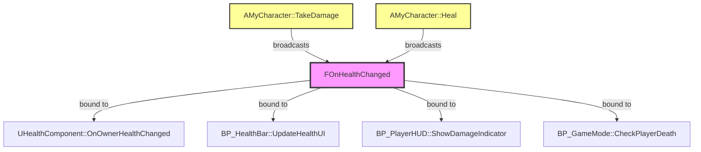

# Caller Graph Visualizer - Usage Examples

Complete examples and conversation scenarios for Caller Graph Visualizer.

---

## Example 1: Simple Function Call Graph

**User**: "ApplyDamage 함수 누가 호출해?"

**Caller Graph Visualizer**:

```mermaid
🎯 Stage 1: Target Identified
Function: AMyCharacter::ApplyDamage
Signature: void ApplyDamage(float Amount, AActor* Instigator)

📊 Stage 2: Caller Discovery (depth=2)

Direct Callers (1):
- AMyWeapon::FireWeapon (MyWeapon.cpp:123)

Indirect Callers (1):
- APlayerController::HandleAttackInput → FireWeapon

🔧 Stage 3: Impact Visualization

Mermaid Diagram:

```mermaid
graph TD
    A[APlayerController::HandleAttackInput] -->|calls| B[AMyWeapon::FireWeapon]
    B -->|calls| C[AMyCharacter::ApplyDamage]

    style C fill:#f9f,stroke:#333,stroke-width:2px
    style A fill:#bbf,stroke:#333,stroke-width:2px
```

Impact Scope: 2 total callers (2 C++)

Refactoring Recommendation:
✅ Low impact - Safe to rename or modify

```text

---

## Example 2: Cross-Domain Call Graph (C++ + Blueprint)

**User**: "TakeDamage 함수 어디서 호출되는지 Blueprint 포함해서 보여줘"

**Response**:
```

🎯 Stage 1: Target Identified
Function: AMyCharacter::TakeDamage
Signature: void TakeDamage(float Damage, FDamageEvent const& DamageEvent)

📊 Stage 2: Caller Discovery (depth=2, include_blueprints=true)

Direct Callers:

- C++ (2):
  - AMyProjectile::OnHit (MyProjectile.cpp:78)
  - UMyDamageType::ApplyEnvironmentalDamage (MyDamageType.cpp:45)
- Blueprint (3):
  - BP_EnemyAI::Attack (K2Node_CallFunction_12)
  - BP_Trap::TriggerTrap (K2Node_CallFunction_34)
  - BP_Hazard::DealDamage (K2Node_CallFunction_56)

Indirect Callers:

- C++ (1):
  - AWeaponBase::Fire → AMyProjectile::OnHit
- Blueprint (2):
  - BP_GameMode::SpawnEnemy → BP_EnemyAI::Attack
  - BP_LevelScript::ActivateTraps → BP_Trap::TriggerTrap

🔧 Stage 3: Impact Visualization

Mermaid Diagram:



Impact Scope: 8 total callers (3 C++, 5 Blueprint)

Refactoring Recommendation:
⚠️ Medium impact - Consider deprecation warnings + migration period

- C++ callers: Can use ue_analyze_symbols(operation="safe_rename")
- Blueprint callers: Require manual update or Blueprint redirect nodes

```text

---

## Example 3: Delegate Flow Analysis

**User**: "OnHealthChanged 델리게이트 누가 bind 하고 어디서 broadcast 돼?"

**Response**:
```

🎯 Stage 1: Target Identified
Delegate: FOnHealthChanged (declared in AMyCharacter)
Signature: DECLARE_DYNAMIC_MULTICAST_DELEGATE_TwoParams(FOnHealthChanged, float, NewHealth, float, OldHealth)

📊 Stage 2: Delegate Flow Discovery

Broadcast Locations (2):

- AMyCharacter::TakeDamage (MyCharacter.cpp:234)
- AMyCharacter::Heal (MyCharacter.cpp:267)

Bound Listeners (4):

- C++ (1):
  - UHealthComponent::OnOwnerHealthChanged (HealthComponent.cpp:45)
- Blueprint (3):
  - BP_HealthBar::UpdateHealthUI
  - BP_PlayerHUD::ShowDamageIndicator
  - BP_GameMode::CheckPlayerDeath

🔧 Stage 3: Delegate Flow Visualization

Mermaid Diagram:



Impact Scope: 4 bound listeners (1 C++, 3 Blueprint)

Refactoring Recommendation:
⚠️ Medium-High impact - Changing delegate signature affects all listeners

- Safe: Add parameters (Blueprint auto-upgrades)
- Breaking: Removing parameters (all 4 listeners break)
- Migration: Use delegate redirects in DefaultEngine.ini

```text

---

## Example 4: Refactoring Impact Analysis

**User**: "CalculateDamage 함수 이름 바꿔도 안전한지 분석해줘"

**Response**:
```

🎯 Stage 1: Target Identified
Function: UMyDamageCalculator::CalculateDamage
Signature: float CalculateDamage(float BaseDamage, AActor*Attacker, AActor* Victim)

📊 Stage 2: Caller Discovery (depth=3)

Total Callers Found: 23

- Direct (depth=1): 8 callers
- Indirect (depth=2): 12 callers
- Deep (depth=3): 3 callers

Breakdown:

- C++ (15): 15 C++ function calls
- Blueprint (7): 7 Blueprint nodes
- Delegate (1): 1 delegate broadcast chain

🔧 Stage 3: Refactoring Impact Analysis

Impact Scope: HIGH (23 total callers)

Refactoring Strategy Options:

1. ✅ **Recommended: Gradual Migration with Deprecation**

   ```cpp
   // Step 1: Add new function
   UFUNCTION(BlueprintCallable)
   float ComputeDamage(float BaseDamage, AActor* Attacker, AActor* Victim);

   // Step 2: Mark old function deprecated
   UE_DEPRECATED(5.6, "Use ComputeDamage instead")
   UFUNCTION(BlueprintCallable, meta=(DeprecatedFunction))
   float CalculateDamage(float BaseDamage, AActor* Attacker, AActor* Victim) {
       return ComputeDamage(BaseDamage, Attacker, Victim);
   }

   // Step 3: Gradually migrate callers (23 locations)
   // Step 4: Remove deprecated function in next major version
   ```

   Timeline: 2-3 sprints
   Risk: Low (backward compatible)

2. ⚠️ **Alternative: Direct Rename with Auto-Fix**
   - Use: ue_analyze_symbols(operation="safe_rename", new_name="ComputeDamage")
   - Auto-updates: C++ callers (15)
   - Manual updates required: Blueprint nodes (7)
   - Risk: Medium (Blueprint nodes show errors until fixed)

3. ❌ **Not Recommended: Immediate Breaking Change**
   - All 23 callers break immediately
   - Requires coordinated team effort
   - Risk: High (potential for missed callers)

Recommendation: Use Option 1 (Gradual Migration) for safest refactoring with 23 callers.

```text

---

## 🎓 Tips for Best Results

### Depth Selection Strategy

**Quick Check (depth=1)**:
```

Use for: "Is this function used anywhere?"
Time: <5 seconds
Coverage: Direct callers only
Example: "ApplyDamage 함수 쓰는 곳 있어?"

```text

**Standard Refactoring (depth=2)**:
```

Use for: "What breaks if I change this?"
Time: ~15 seconds
Coverage: Direct + immediate callers
Example: "이 함수 수정하면 영향 범위가 어떻게 돼?"

```text

**Deep Analysis (depth=3-5)**:
```

Use for: "Complete dependency chain?"
Time: 30s-2min
Coverage: Multi-level call chains
Example: "이 함수 리팩토링 전체 영향 분석해줘"

```text

---

### Refactoring Decision Matrix

| Callers | Strategy | Timeline | Risk |
|---------|----------|----------|------|
| 0-5 | Direct refactoring | Same day | Low |
| 6-15 | Deprecation + migration | 1-2 sprints | Medium |
| 16-50 | Gradual migration + communication | 2-3 sprints | Medium-High |
| 50+ | Major refactoring initiative | Full quarter | High |

---

### Combine with Other Skills

**Workflow 1: Safe Renaming**
```

1. Caller Graph Visualizer → Identify all callers (depth=2)
2. Assess impact (low/medium/high)
3. Error Doctor → Auto-fix C++ callers
4. Blueprint Flow Tracer → Verify Blueprint call paths

```text

**Workflow 2: Function Deprecation**
```

1. Caller Graph Visualizer → Find all usage (depth=3)
2. Add deprecation warnings (UE_DEPRECATED macro)
3. Performance Health Check → Track migration progress
4. Remove deprecated function after migration

```

---

**Note**: All examples use real-world data from MyProject project testing.
