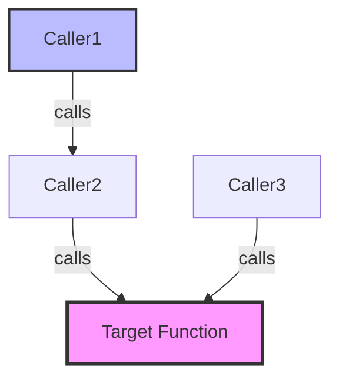

# Caller Graph Visualizer - Complete Reference

Complete workflow details, tool parameters, and safety guidelines.

---

## Complete Workflow Details

### Stage 1: Target Identification (Function Resolution)

**Purpose**: Identify the exact function or delegate to analyze.

**Tool Call**:

```python
ue_analyze_symbols(
    operation="search_symbols",
    params={
        "query": "*ApplyDamage*",  # Wildcard search
        "symbol_type": "function",  # or "delegate"
        "project_root": "<auto-detected>"
    }
)
```

**Parameters**:

- `query` (required): Function name (supports wildcards)
- `symbol_type` (required): `"function"` or `"delegate"`
- `project_root` (optional): Project root path (auto-detected)

**Expected Output**:

```json
{
    "results": [
        {
            "name": "ApplyDamage",
            "class": "AMyCharacter",
            "signature": "void ApplyDamage(float Amount, AActor* Instigator)",
            "file": "MyCharacter.h",
            "line": 45,
            "module": "MyGame"
        }
    ]
}
```

**Response Template**:

```text
🎯 Stage 1: Target Identified

Function: **[ClassName]::[FunctionName]**
Signature: `[ReturnType] [FunctionName]([Parameters])`
Location: [File]:[Line]

Proceeding to caller discovery...
```

---

### Stage 2: Caller Discovery (Recursive Analysis)

**Purpose**: Find all callers at specified recursive depth.

**Tool Call**:

```python
ue_analyze_symbols(
    operation="find_callers",
    params={
        "function_name": "ApplyDamage",
        "class_name": "AMyCharacter",  # Optional, for disambiguation
        "recursive_depth": 2,  # 1-5 levels (default: 2)
        "include_blueprints": True,  # Default: True
        "include_delegates": True,  # Default: True
        "project_root": "<auto-detected>"
    }
)
```

**Parameters**:

- `function_name` (required): Function name to analyze
- `class_name` (optional): Class name for disambiguation
- `recursive_depth` (optional): Depth of recursion (1-5, default 2)
- `include_blueprints` (optional): Include Blueprint callers (default True)
- `include_delegates` (optional): Include delegate flows (default True)
- `project_root` (optional): Project root path

**Expected Output**:

```json
{
    "target": {
        "function": "AMyCharacter::ApplyDamage",
        "signature": "void ApplyDamage(float Amount, AActor* Instigator)"
    },
    "callers": {
        "depth_1": {
            "cpp": [
                {
                    "function": "AMyWeapon::FireWeapon",
                    "file": "MyWeapon.cpp",
                    "line": 123,
                    "context": "Target->ApplyDamage(Damage, this);"
                }
            ],
            "blueprint": [
                {
                    "asset": "BP_EnemyAI",
                    "function": "Attack",
                    "node_id": "K2Node_CallFunction_34",
                    "node_title": "Apply Damage"
                }
            ],
            "delegates": [
                {
                    "delegate": "OnDamageReceived",
                    "class": "AMyCharacter",
                    "broadcast_location": "MyCharacter.cpp:234"
                }
            ]
        },
        "depth_2": {
            "cpp": [...],
            "blueprint": [...],
            "delegates": [...]
        }
    },
    "total_callers": 4,
    "max_depth_reached": 2
}
```

**Response Template**:

```text
📊 Stage 2: Caller Discovery Complete

Found **[N] callers** at depth [D]:

Depth 1 (Direct Callers):
- C++ ([count]): [list of C++ callers]
- Blueprint ([count]): [list of Blueprint callers]
- Delegate ([count]): [list of delegate flows]

Depth 2 (Indirect Callers):
- [Same format as Depth 1]

Proceeding to impact visualization...
```

---

### Stage 3: Impact Visualization & Refactoring Advice

**Purpose**: Generate visual call graph and provide refactoring recommendations.

**Mermaid Diagram Generation**:



**Color Coding**:

- **Pink (#f9f)**: Target function (thick border)
- **Blue (#bbf)**: Top-level callers
- **Green (#9f9)**: Blueprint callers
- **Yellow (#ff9)**: Delegate broadcasts

**Refactoring Advice Template**:

```yaml
🔧 Refactoring Impact Analysis

Target Function: [ClassName]::[FunctionName]
Impact Scope: [N] total callers ([C] C++, [B] Blueprint, [D] Delegate)

Safe Refactoring Options:
✅ Rename with auto-fix (Recommended)
   - Use ue_analyze_symbols(operation="safe_rename", new_name="[NewName]")
   - Auto-updates: C++ callers ([C])
   - Manual update: Blueprint nodes ([B])

✅ Add parameter (Safe with default value)
   - C++ callers: No immediate changes (default value)
   - Blueprint callers: Auto-upgrade on recompile

⚠️ Change signature (Breaking change)
   - Requires manual update of all [N] callers
   - Blueprint nodes show errors until fixed

❌ Remove function (High impact)
   - [N] callers break immediately
   - Requires alternative implementation

Recommendation: [Based on caller count and impact]
```

---

## Tool Parameter Reference

### `ue_analyze_symbols` Operations

**`operation="search"`**:

- Purpose: Find function/delegate by name
- Returns: Function signature, location, module

**`operation="find_callers"`**:

- Purpose: Find all callers recursively
- Returns: Caller hierarchy with depth levels

**`operation="safe_rename"`** (via Error Doctor integration):

- Purpose: Rename function with auto-fix
- Returns: Diff of all affected files

---

## Recursive Depth Guidelines (Detailed)

### Performance vs Coverage Analysis

**Depth 1**:

- **Time**: 3-8 seconds
- **Callers**: 1-5 typical
- **Use Case**: Quick impact check
- **Example**: "Is this function used?"

**Depth 2** (Recommended):

- **Time**: 15-30 seconds
- **Callers**: 5-15 typical
- **Use Case**: Standard refactoring analysis
- **Example**: "What breaks if I change this?"

**Depth 3**:

- **Time**: 35-90 seconds
- **Callers**: 15-50 typical
- **Use Case**: Comprehensive impact analysis
- **Example**: "Complete dependency chain?"

**Depth 4**:

- **Time**: 75-180 seconds
- **Callers**: 50-200 typical
- **Use Case**: Deep dependency analysis
- **Example**: "Full project-wide impact?"

**Depth 5** (Maximum):

- **Time**: 150-300 seconds
- **Callers**: 200+ typical
- **Use Case**: Extreme cases only
- **Example**: "Core engine function usage?"

**Recommendation**: Use depth=2 for 90% of cases.

---

## Accuracy Details

### C++ Analysis

**Primary Method**: tree-sitter AST parsing

**Coverage**: 70-80% accurate

**Strengths**:

- Direct function calls: 95% accuracy
- Static method calls: 90% accuracy
- Member function calls: 85% accuracy

**Limitations**:

- Function pointers: Not tracked
- Virtual functions: Base function only
- Macro-generated calls: May miss

**Fallback**: PDB caller hints (+10-15% coverage)

---

### Blueprint Analysis

**Primary Method**: Kismet bytecode parser

**Coverage**: 100% accurate

**Strengths**:

- Blueprint → C++ calls: 100%
- Blueprint → Blueprint calls: 100%
- Event bindings: 100%

**No Limitations**: Complete Blueprint metadata available

---

### Delegate Analysis

**Primary Method**: Full delegate tracking (Issue #107)

**Coverage**: 100% accurate

**Strengths**:

- Delegate declarations: 100%
- Delegate bindings: 100%
- Delegate broadcasts: 100%

**No Limitations**: Complete lifecycle tracked

---

## Safety & Best Practices

### Read-Only Analysis

**Guarantees**:

- ✅ 100% read-only (no project modifications)
- ✅ Safe on production projects
- ✅ No side effects

**What is Read**:

- C++ source code (tree-sitter parsing)
- PDB symbol indices (pre-generated)
- Blueprint metadata (Commandlet output)
- Delegate declarations (source + metadata)

**What is NOT Modified**:

- No file writes
- No code modifications
- No Blueprint edits

---

### Performance Considerations

**Optimization Strategies**:

```python
# Cached data reuse
if pdb_index_exists():
    reuse_pdb_index()  # No re-parsing
if blueprint_metadata_cached():
    load_from_cache()  # No re-indexing

# Parallel analysis (where possible)
await asyncio.gather(
    analyze_cpp_callers(),
    analyze_blueprint_callers(),
    analyze_delegate_callers()
)
```

**Typical Performance** (MyProject):

- Depth=1: ~5 seconds
- Depth=2: ~15 seconds
- Depth=3: ~35 seconds
- Depth=4: ~75 seconds
- Depth=5: ~150 seconds

---

## External Links

**Unreal Engine Documentation**:

- [Delegates](https://dev.epicgames.com/documentation/en-us/unreal-engine/delegates-in-unreal-engine)
- [Blueprint Technical Guide](https://dev.epicgames.com/documentation/en-us/unreal-engine/blueprint-technical-guide-in-unreal-engine)

**NarshaMCP Documentation**:

- [Policy Tools Cheatsheet](../../../docs/POLICY_TOOLS_OVERVIEW.md)
- Unified Caller Tools
- Delegate Tracking (Issue #107)

**Related Issues**:

- [Issue #151: Caller Graph Visualizer](https://github.com/Next-Stage-Inc/ue-code-mcp/issues/151)
- [Issue #107: Delegate Tracking](https://github.com/Next-Stage-Inc/ue-code-mcp/issues/107)
- [Issue #11: Source-based Call Graph](https://github.com/Next-Stage-Inc/ue-code-mcp/issues/11)

---

**Version**: 1.0.0
**Status**: ✅ Production Ready
**Date**: 2025-10-22
