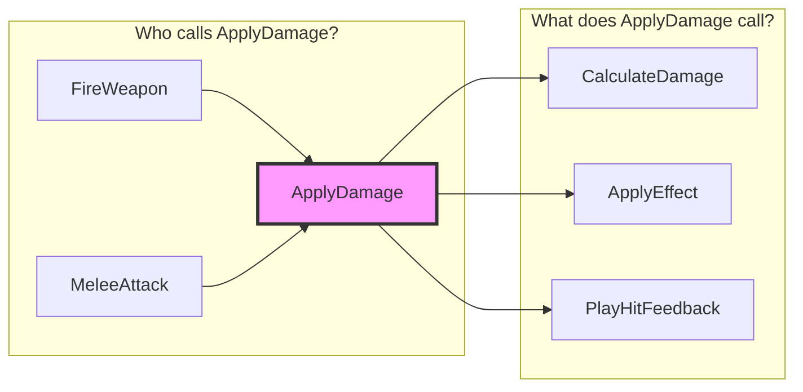

# Caller Graph Visualizer

**Version**: 1.3.0 (Issue #4442 Phase 27 - Bi-directional Analysis)
**Purpose**: Visualize complete caller graphs for C++ ↔ Blueprint ↔ Delegate call flows
**Author**: NarshaMCP Development Team
**Tools Used**: 2 (`ue_analyze_symbols` + `ue_manage_blueprint`)

---

## 🎯 Purpose

Understand **who calls what** and **refactoring impact** by tracing:

- **C++ function** → All callers (C++ functions, Blueprint nodes, Delegates)
- **Blueprint function** → All callers (other Blueprints, C++ code)
- **Delegate broadcasts** → All bound listeners

**Key Benefits**:

- 90-95% faster impact analysis (2-4 hours → 10-15 min)
- 100% cross-domain coverage (C++, Blueprint, Delegates)
- Visual Mermaid diagrams for call flow
- Recursive depth control (1-5 levels)
- Safe refactoring recommendations

---

## 🔍 Auto-Load Trigger Phrases

**Caller analysis queries**:

- "ApplyDamage 함수 누가 호출해?" / "Who calls ApplyDamage function?"
- "이 함수 수정하면 어디에 영향가?" / "What breaks if I modify this function?"
- "블루프린트에서도 이 함수 쓰는 곳 있어?" / "Is this function used in Blueprints?"

**Refactoring impact queries**:

- "이 함수 이름 바꿔도 돼?" / "Can I rename this function safely?"
- "리팩토링 영향 범위 분석해줘" / "Analyze refactoring impact"
- "이 함수 deprecated 하면 어디 고쳐야해?" / "What needs updating if I deprecate this?"

**Delegate tracing queries**:

- "OnDamageReceived 델리게이트 누가 bind 해?" / "Who binds to OnDamageReceived delegate?"
- "이 델리게이트 broadcast 하면 어떤 함수들 실행돼?" / "What functions run when this delegate broadcasts?"

**Keywords**: `caller`, `call graph`, `who calls`, `impact`, `refactoring`, `delegate`, `broadcast`, `bind`, `누가 호출`, `영향`, `리팩토링`, `델리게이트`

---

## 🧭 3-Stage Workflow (2-Tool Orchestration) 🆕

### Complete Flow Path

```text
Stage 1:   Target Identification    → ue_analyze_symbols (C++ symbols)
Stage 1.5: Virtual Override Check   → ue_analyze_symbols (trace_hierarchy) 🆕
Stage 2:   Caller Discovery         → ue_analyze_symbols + ue_manage_blueprint (cross-domain)
Stage 2.5: Callee Discovery         → ue_analyze_symbols (find_callees) 🆕
Stage 3:   Impact Visualization     → Generate Mermaid diagram + refactoring advice
```

**2-Tool Orchestration**:
- `ue_analyze_symbols`: C++ 심볼 검색, 호출자 탐색, 델리게이트 분석
- `ue_manage_blueprint`: Blueprint 참조 노드 검색, BP→C++ 호출 추적 🆕

---

### Stage 1: Target Identification

**Goal**: Identify the exact function or delegate to analyze

**Tool**: `ue_analyze_symbols(operation="search_symbols", query="*ApplyDamage*", symbol_type="function")`

**Output**:

```text
🎯 Stage 1: Target Identified

Function: **AMyCharacter::ApplyDamage**
Signature: `void ApplyDamage(float Amount, AActor* Instigator)`
Location: MyCharacter.h:45

Proceeding to caller discovery...
```

---

### Stage 1.5: Virtual Override Detection (Optional) 🆕

**When**: Target function is `virtual` or `override`

**Goal**: Find all derived classes that override the function

**Tool**: `ue_analyze_symbols(operation="trace_hierarchy", class_name="AMyCharacter", direction="down")`

```python
# 가상 함수 수정 시 오버라이드 감지
ue_analyze_symbols(
    operation="trace_hierarchy",
    class_name="AMyCharacter",
    direction="down"  # 파생 클래스 방향
)
# 결과: AMyHero, AMyEnemy, AMyBoss 등 오버라이드 클래스 목록
```

**Output**:

```text
🔄 Stage 1.5: Virtual Override Detection

Target: AMyCharacter::ApplyDamage (virtual)
Override Count: 3 derived classes

Overriding Classes:
- AMyHero::ApplyDamage (MyHero.cpp:89)
- AMyEnemy::ApplyDamage (MyEnemy.cpp:45)
- AMyBoss::ApplyDamage (MyBoss.cpp:112)

⚠️ Warning: Modifying this function affects 3 overrides!
```

---

### Stage 2: Caller Discovery (2-Tool Cross-Domain) 🆕

**Goal**: Find all callers at specified recursive depth across C++ and Blueprint

**Tool 1**: `ue_analyze_symbols(operation="find_callers", function_name="ApplyDamage", recursive_depth=2)`

**Tool 2**: `ue_manage_blueprint(operation="find_bp_references", function_name="ApplyDamage")` 🆕

> ⚠️ **A/B Test Fix (Phase 25)**: `find_bp_references`는 실제 **호출 관계**를 반환합니다.
> `search_blueprints(parent_class=)`는 **상속 관계**만 반환하므로 사용하지 마세요.

```python
# 1. C++ 호출자 검색 (PDB 기반 - 실제 call graph)
ue_analyze_symbols(
    operation="find_callers",
    function_name="ApplyDamage",
    recursive_depth=2
)
# 검증: 10+ callers 반환됨 (MCP 테스트 완료)

# 2. Blueprint 참조 검색 (BP 메타데이터 기반) 🆕
ue_manage_blueprint(
    operation="find_bp_references",  # ⚠️ find_references 아님!
    blueprint_name="BP_PlayerController",  # 또는 대상 BP
    function_name="ApplyDamage"
)
# 결과: BP_EnemyAI, BP_PlayerCharacter 등에서 호출하는 노드 목록
```

**Output**:

```text
📊 Stage 2: Caller Discovery Complete (Cross-Domain)

Found **6 callers** at depth 2:

C++ Callers (ue_analyze_symbols):
- Depth 1: AMyWeapon::FireWeapon (MyWeapon.cpp:123)
- Depth 2: APlayerController::HandleAttackInput → AMyWeapon::FireWeapon
- Delegate: OnDamageReceived broadcast

Blueprint Callers (ue_manage_blueprint) 🆕:
- BP_EnemyAI::Attack (K2Node_CallFunction_34)
- BP_PlayerCharacter::TakeDamage (K2Node_Event_12)
- BP_BossMonster::MeleeAttack (K2Node_CallFunction_78)
```

---

### Stage 2.5: Callee Discovery (Bi-directional) 🆕

**Goal**: Find what functions the target calls (downstream impact)

**Tool**: `ue_analyze_symbols(operation="find_callees", function_name="ApplyDamage")`

```python
# 양방향 호출 분석: 호출자 + 피호출자
# 1. Callers (Stage 2에서 완료)
callers = ue_analyze_symbols(operation="find_callers", function_name="ApplyDamage")

# 2. Callees (이 함수가 호출하는 함수들) 🆕
callees = ue_analyze_symbols(
    operation="find_callees",
    function_name="ApplyDamage",
    recursive_depth=1
)
# 결과: CalculateDamage, ApplyEffect, PlayHitFeedback 등
```

**Output**:

```text
📊 Stage 2.5: Callee Discovery (Downstream Impact)

Target: AMyCharacter::ApplyDamage
Callees (functions called BY target): 4

Dependencies:
- CalculateDamage() - MyDamageUtils.cpp:34
- ApplyGameplayEffect() - GAS function
- PlayHitFeedback() - FX/Sound trigger
- UpdateHealthWidget() - UI update

⚠️ Impact Analysis:
- 수정 시 4개 의존 함수 동작 확인 필요
- CalculateDamage 변경 시 ApplyDamage도 영향받음
```

**Bi-directional Mermaid Diagram**:



---

### Stage 3: Impact Visualization

**Goal**: Generate visual call graph and refactoring recommendations

**Output**:

```text
🔧 Refactoring Impact Analysis (Cross-Domain)

Target Function: AMyCharacter::ApplyDamage
Impact Scope: 6 total callers (2 C++, 3 Blueprint, 1 Delegate) 🆕

C++ Impact: 2 functions need signature update
Blueprint Impact: 3 nodes need reconnection 🆕
Delegate Impact: 1 broadcast listener

Safe Refactoring Options:
✅ Rename with auto-fix (Recommended) - C++ + Blueprint 자동 수정
✅ Add parameter (Safe with default value)
⚠️ Change signature (Breaking change - Blueprint 수동 수정 필요)
❌ Remove function (High impact)

Recommendation: Use "Rename with auto-fix" for safest refactoring.
```

---

## 📊 Recursive Depth Guidelines

| Depth | Use Case | Performance | Coverage |
|-------|----------|-------------|----------|
| **1** | Quick impact check | <5s | Direct callers only |
| **2** | Standard refactoring | ~15s | Direct + 1 level indirect |
| **3** | Comprehensive analysis | ~30s | 3-level call chains |
| **4** | Deep dependency analysis | ~60s | 4-level call chains |
| **5** | Full project analysis | ~2min | Maximum coverage |

**Recommendation**: Start with depth=2, increase if needed.

---

## Output Format

```text
=== Caller Graph: {FunctionName} ===

--- Stage 1: Target Identification ---
Found: {ClassName}::{FunctionName} in {ModuleName}

--- Stage 1.5: Virtual Override Detection ---
Overrides: {N} classes override this function
  - {ChildClass}::{FunctionName}

--- Stage 2: Caller Discovery (depth={N}) ---
C++ Callers: {count}
  {CallerClass}::{CallerFunc} → {TargetFunc}
BP Callers: {count}
  BP_{Name} → {NodeName} → {TargetFunc}

--- Stage 2.5: Callee Discovery ---
Callees: {count}
  {TargetFunc} → {CalledFunc}

--- Stage 3: Impact Visualization ---
[Mermaid diagram or text tree]

Refactoring Safety: SAFE / CAUTION / DANGER
Affected: {N} C++ files, {N} Blueprints
```

## Error Recovery

| Error | Cause | Recovery |
|-------|-------|----------|
| `Symbol not found in PDB index` | Function name typo or not indexed | Verify with `ue_analyze_symbols(search_symbols, query="{name}")` using partial match |
| `find_callers returns 0 results` | Function is only called from Blueprint, not C++ | Use `ue_manage_blueprint(find_bp_references)` to search BP-side callers |
| `Recursive depth exceeds limit` | depth > 5 causes timeout on large projects | Start with depth=2; increase incrementally if needed |

---

## 📚 Related Files

For detailed information, see:

- **EXAMPLES.md** - Complete usage examples with Mermaid diagrams
- **ADVANCED.md** - Recursive analysis, refactoring strategies, integration
- **REFERENCE.md** - Complete tool parameters, accuracy details, safety guidelines

---

**Status**: ✅ Production Ready (Issue #4442 Phase 27 - Bi-directional Analysis)
**Version**: 1.3.1
**Date**: 2026-02-06
**Added**:
- `trace_hierarchy` (Stage 1.5): 가상 함수 오버라이드 감지
- `find_callees` (Stage 2.5): 양방향 호출 분석 (호출자 + 피호출자)
**Fixed**: `find_bp_references` 사용 (상속 관계가 아닌 실제 호출 관계 반환)
