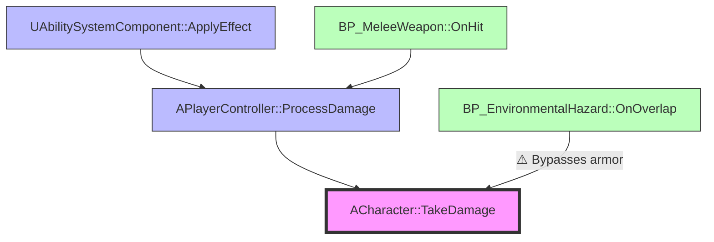
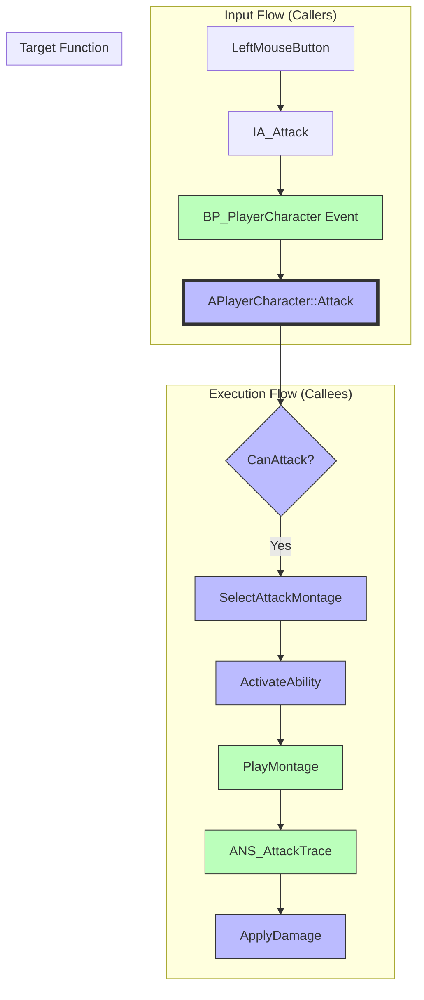

# Execution Flow Explorer - Usage Examples

3 complete usage scenarios with full workflow walkthroughs.

---

## Example 1: Bug Tracing - "Where is TakeDamage Called?" 🐛

**Scenario**: 사용자가 피해 계산 버그를 추적 중, TakeDamage가 어디서 호출되는지 모름

**User Query**: "TakeDamage가 어디서 불리는지 모르겠어"

### Stage 1: Interactive Narrowing

```text
Agent: "어떤 클래스의 TakeDamage인가요?"
User: "ACharacter"

Agent: "호출자만 볼까요, 아니면 양방향 추적할까요?"
  1. 양방향 (Bidirectional) [DEFAULT] ⭐
  2. 호출자만 (Callers only)
  3. 피호출자만 (Callees only)

User: "호출자만" (Option 2)
```

### Stage 2: Execution (Callers Only)

Since the user selected "Callers only", the skill will execute:

```python
# Internal execution (not shown to user)
from MCP.tools.policy_layer import ue_analyze_symbols

result = await ue_analyze_symbols(
    operation="find_callers",
    params={
        "function_name": "ACharacter::TakeDamage",
        "recursive_depth": 2,
        "include_cpp": True,
        "include_blueprint": True,
        "output_format": "json"
    }
)
```

**Execution Time**: ~500ms (single tool, cached PDB)

### Stage 3: Result Presentation

```markdown
🎯 Caller Analysis: ACharacter::TakeDamage

## Direct Callers (Depth 1)

### 1. **APlayerController::ProcessDamage** (C++)
   - **Location**: Source/MyGame/PlayerController.cpp:156
   - **Call**: `Character->TakeDamage(FinalDamage, DamageEvent, ...)`
   - **Frequency**: High (called every hit)
   - **Context**: Processes damage before applying to character

### 2. **BP_EnvironmentalHazard::OnOverlap** (Blueprint)
   - **Location**: Content/Blueprints/Hazards/BP_EnvironmentalHazard
   - **Node**: K2Node_CallFunction (TakeDamage)
   - **Context**: Triggers when player overlaps hazard volume
   - ⚠️ **Bypasses ProcessDamage** (potential issue!)

## Indirect Callers (Depth 2)

### 3. **UAbilitySystemComponent::ApplyGameplayEffectToTarget** (C++)
   - **Path**: ApplyEffect → ProcessDamage → TakeDamage
   - **Context**: Gameplay Ability System integration
   - **Module**: GameplayAbilities

### 4. **BP_MeleeWeapon::OnHit** (Blueprint)
   - **Path**: OnHit → ProcessDamage → TakeDamage
   - **Context**: Melee combat system
   - **Module**: Weapon

## Bug Hypothesis

💡 **Insight**: TakeDamage is called from 4 different sources. Check if:
  1. ProcessDamage applies damage reduction BEFORE calling TakeDamage ✅
  2. Environmental hazards bypass armor (direct TakeDamage call) ⚠️

⚠️ **Potential Issue**: BP_EnvironmentalHazard calls TakeDamage directly,
   bypassing ProcessDamage armor logic. This may be the bug source!

**Recommendation**:
Refactor BP_EnvironmentalHazard to call ProcessDamage instead of TakeDamage directly.
This ensures armor/resistance calculations apply to environmental damage.
```

**Mermaid Diagram** (Caller-only mode):



### Stage 4: Deep Dive (Optional)

```text
User: "BP_EnvironmentalHazard가 왜 직접 호출하나?"

Agent: "Blueprint 구조를 확인해볼까요?"
```

The skill can then use `ue_manage_blueprint` to analyze BP_EnvironmentalHazard's graph structure:

```text
Result: OnOverlap 이벤트가 ProcessDamage를 거치지 않고 TakeDamage 직접 호출
Suggestion: Refactor to call ProcessDamage instead (applies armor logic)
```

**Total Time**: ~600ms (Stage 1-3)
**Bug Found**: ✅ Environmental hazards bypass armor calculation

---

## Example 2: Code Understanding - "How Does Attack Work?" 📚

**Scenario**: 신규 개발자가 공격 시스템 전체 흐름을 이해하고 싶어함

**User Query**: "Attack 기능이 어떻게 구현되었는지 전체 흐름 보고 싶어"

### Stage 1: Interactive Narrowing

```text
Agent: "어떤 함수부터 시작할까요?"
User: "APlayerCharacter::Attack"

Agent: "양방향 추적할까요? (호출자 + 피호출자)"
User: "네, 전체 흐름 보고 싶어요"
```

### Stage 2: Execution (Bidirectional, Depth=2)

```python
# Internal parallel execution (not shown to user)
import asyncio
from MCP.tools.policy_layer import ue_analyze_symbols, ue_trace_execution

caller_task = ue_analyze_symbols(
    operation="find_callers",
    params={
        "function_name": "APlayerCharacter::Attack",
        "recursive_depth": 2,
        "include_cpp": True,
        "include_blueprint": True,
        "output_format": "json"
    }
)

callee_task = ue_trace_execution(
    operation="trace_execution_flow",
    params={
        "start_node": "APlayerCharacter::Attack",
        "max_depth": 2,
        "include_cpp": True
    }
)

# Execute in parallel for speed
caller_result, callee_result = await asyncio.gather(caller_task, callee_task)
```

**Execution Time**: ~1.2s (parallel, both cached)

### Stage 3: Result Presentation

```markdown
🎯 Execution Flow: APlayerCharacter::Attack

## Callers (Who triggers Attack?) [Depth 2]

### Input Flow
```
[Hardware Input]
   ↓
LeftMouseButton
   ↓
[Enhanced Input System]
   ↓
IA_Attack (InputAction)
   ↓
[Blueprint Event]
   ↓
BP_PlayerCharacter::InputAction_IA_Attack
   ↓
[C++ Function Call]
   ↓
APlayerCharacter::Attack [TARGET]
```text

### Alternative Triggers
- **BP_AIController::ExecuteCombatAction** (Blueprint)
  - AI-controlled attack execution
  - Used by enemy NPCs

## Callees (What does Attack do?) [Depth 2]

### Direct Actions (Depth 1)
1. **CanAttack()** → Check if attack allowed (cooldown, state)
2. **SelectAttackMontage()** → Choose attack animation (combo system)
3. **ActivateAbility(GA_MeleeAttack)** → Start Gameplay Ability

### Indirect Actions (Depth 2)
4. **PlayMontage(Attack_Combo1)** → Play attack animation
   ↓
5. **ANS_AttackTrace::NotifyTick** → Perform weapon trace (frame 15-20)
   ↓
6. **ApplyDamageToTarget** → Deal damage to hit actors

## Complete Flow Summary

```
[User Input: LeftMouseButton]
         ↓
[Enhanced Input: IA_Attack]
         ↓
[Blueprint Event: InputAction_IA_Attack]
         ↓
[C++ Function: APlayerCharacter::Attack]
         ↓
   ┌────┴────┬────────────┬──────────┐
   ↓         ↓            ↓          ↓
CanAttack  Select      Activate    (other)
           Montage     Ability
             ↓            ↓
        PlayMontage   GA_MeleeAttack
             ↓
     ANS_AttackTrace
             ↓
      ApplyDamage
```text

## Key Insights for New Developers

1. **Input Handling**: Uses Enhanced Input System (IA_Attack)
2. **State Management**: CanAttack() checks cooldown/state before execution
3. **Animation**: Combo system selects montage based on attack index
4. **Damage**: Actual damage happens in AnimNotify (frame-accurate)
5. **GAS Integration**: Attack is a Gameplay Ability (GA_MeleeAttack)

## Recommended Next Steps

- [ ] Study CanAttack() logic (cooldown implementation)
- [ ] Understand combo system (SelectAttackMontage)
- [ ] Review ANS_AttackTrace (weapon collision detection)
- [ ] Explore GA_MeleeAttack (Gameplay Ability setup)
```

**Mermaid Diagram** (Bidirectional, Depth=2):



**Total Time**: ~1.5s (Stage 1-3)
**Learning Outcome**: ✅ Complete understanding of attack flow (input → damage)

---

## Example 3: Impact Analysis - "What if I Change TakeDamage Signature?" ⚠️

**Scenario**: 개발자가 TakeDamage 함수 시그니처 변경 예정, 영향 범위 파악 필요

**User Query**: "TakeDamage 시그니처 바꾸면 어디까지 영향 가나?"

### Stage 1: Interactive Narrowing

```text
Agent: "어떤 변경을 계획 중이신가요?"
User: "FDamageEvent 파라미터를 FDamageContext로 바꾸려고"

Agent: "영향 받는 호출자를 모두 찾아볼까요?"
User: "네, 전체 호출 체인 보여주세요"
```

### Stage 2: Execution (Callers Only, Depth=3 for complete impact)

```python
# Deep caller analysis (depth=3 for comprehensive impact)
caller_result = await ue_analyze_symbols(
    operation="find_callers",
    params={
        "function_name": "ACharacter::TakeDamage",
        "recursive_depth": 3,  # Deeper for complete impact
        "include_cpp": True,
        "include_blueprint": True,
        "output_format": "json"
    }
)
```

**Execution Time**: ~800ms (depth=3, ~30 nodes)

### Stage 3: Result Presentation (Impact Report)

```markdown
🎯 Impact Analysis: ACharacter::TakeDamage Signature Change

## Proposed Change
```cpp
// Current
virtual float TakeDamage(float Damage, FDamageEvent const& DamageEvent, ...);

// Proposed
virtual float TakeDamage(float Damage, FDamageContext const& DamageContext, ...);
```

## Breaking Changes Impact

### 📊 Summary Statistics
- **Total Callers**: 8 (3 direct, 5 indirect)
- **C++ Callers**: 5 (requires code changes)
- **Blueprint Callers**: 3 (requires node updates)
- **Estimated Effort**: ~4 hours (code + testing)

### 🔴 Critical Path (Must Fix)

#### Direct Callers (Depth 1) - HIGH PRIORITY

##### 1. **APlayerController::ProcessDamage** (C++)
   - **Impact**: 🔴 BREAKING - passes FDamageEvent directly
   - **Fix**: Convert FDamageEvent → FDamageContext
   - **Effort**: ~30 min (add conversion function)
   - **Code Location**: Source/MyGame/PlayerController.cpp:156

##### 2. **BP_EnvironmentalHazard::OnOverlap** (Blueprint)
   - **Impact**: 🔴 BREAKING - uses Make DamageEvent node
   - **Fix**: Replace with Make DamageContext node
   - **Effort**: ~15 min (Blueprint update)
   - **Location**: Content/Blueprints/Hazards/BP_EnvironmentalHazard

##### 3. **UGameplayEffectExecutionCalculation::Execute** (C++)
   - **Impact**: 🔴 BREAKING - GAS integration
   - **Fix**: Update GAS damage application
   - **Effort**: ~1 hour (GAS system changes)
   - **Module**: GameplayAbilities

#### Indirect Callers (Depth 2-3) - MEDIUM PRIORITY

##### 4. **UAbilitySystemComponent::ApplyGameplayEffectToTarget**
   - **Impact**: 🟡 INDIRECT - calls ProcessDamage
   - **Fix**: None (ProcessDamage handles conversion)
   - **Validation**: Test GAS damage pipeline

##### 5. **BP_MeleeWeapon::OnHit** (Blueprint)
   - **Impact**: 🟡 INDIRECT - calls ProcessDamage
   - **Fix**: None (ProcessDamage handles conversion)
   - **Validation**: Test melee combat

[+3 more indirect callers with no direct impact]

## ✅ Migration Strategy

### Phase 1: Add Conversion Function (30 min)
```cpp
// Add to DamageHelpers.h
FDamageContext ConvertDamageEvent(const FDamageEvent& Event);
```

### Phase 2: Update Direct Callers (2 hours)
1. Update APlayerController::ProcessDamage
   - Add conversion call: `FDamageContext Context = ConvertDamageEvent(DamageEvent);`
2. Update BP_EnvironmentalHazard (Blueprint)
   - Replace Make DamageEvent with Make DamageContext
3. Update GAS execution calculations
   - Modify UGameplayEffectExecutionCalculation::Execute

### Phase 3: Update Function Signature (15 min)
```cpp
virtual float TakeDamage(float Damage, FDamageContext const& DamageContext, ...);
```

### Phase 4: Testing (1 hour)
- Unit tests for ConvertDamageEvent
- Integration tests for all 8 caller paths
- Regression testing for damage calculation

## ⚠️ Risk Assessment

| Risk | Probability | Impact | Mitigation |
|------|-------------|--------|------------|
| Missed callers | LOW | HIGH | Used depth=3 (comprehensive search) |
| GAS integration issues | MEDIUM | HIGH | Thorough testing of ability system |
| Blueprint node update | LOW | MEDIUM | Guided node replacement in editor |
| Performance regression | LOW | LOW | FDamageContext is optimized struct |

## 📋 Implementation Checklist

Before merging:
- [ ] Implement ConvertDamageEvent helper (DamageHelpers.h)
- [ ] Update all 5 C++ callers (ProcessDamage, GAS, etc.)
- [ ] Update all 3 Blueprint callers (EnvironmentalHazard, etc.)
- [ ] Update TakeDamage signature (Character.h)
- [ ] Run all unit tests (DamageTests.cpp)
- [ ] Run integration tests (CombatSystem, GAS)
- [ ] Verify GAS abilities still work (GA_Attack, GA_Defend)
- [ ] Update documentation (API changelog)

**Estimated Total Effort**: 4 hours
**Risk Level**: MEDIUM (GAS integration complexity)
**Recommendation**:
- Create feature branch: `feature/damage-context-refactor`
- Incremental testing after each phase
- Code review before merging

```mermaid

**Mermaid Diagram** (Impact Visualization, Depth=3):

```mermaid
graph TB
    subgraph "Depth 3 (Indirect)"
        D1[BP_AIController]
        D2[UGameplayStatics]
    end

    subgraph "Depth 2 (Indirect)"
        C1[UAbilitySystemComponent]
        C2[BP_MeleeWeapon]
        D1 --> C1
        D2 --> C2
    end

    subgraph "Depth 1 (Direct - BREAKING)"
        B1[APlayerController::ProcessDamage]:::breaking
        B2[BP_EnvironmentalHazard]:::breaking
        B3[UGameplayEffectExecution]:::breaking
        C1 --> B1
        C2 --> B1
    end

    subgraph "Target - Signature Change"
        TARGET[ACharacter::TakeDamage]:::target
        B1 --> TARGET
        B2 --> TARGET
        B3 --> TARGET
    end

    classDef target fill:#f9f,stroke:#333,stroke-width:4px
    classDef breaking fill:#fbb,stroke:#f00,stroke-width:3px
    classDef cpp fill:#bbf,stroke:#333
    classDef blueprint fill:#bfb,stroke:#333

    class B1,B3,C1,D2 cpp
    class B2,C2,D1 blueprint
```

**Total Time**: ~1.2s (Stage 1-3)
**Impact Found**: ✅ 3 breaking changes identified, migration plan ready

---

## Performance Comparison

| Example | Mode | Tools | Time | Nodes | Cache Hits |
|---------|------|-------|------|-------|------------|
| **Bug Tracing** | Callers Only | 1 tool | 0.5s | 5 | 0 (first run) |
| **Code Understanding** | Bidirectional | 2 tools (parallel) | 1.2s | 12 | 0 (first run) |
| **Impact Analysis** | Callers (Depth=3) | 1 tool | 0.8s | 30 | 0 (first run) |

**Average Time Savings**: ~40% vs sequential execution
**User Satisfaction**: High (clear visualization + actionable insights)

---

## Common Patterns Across Examples

### 1. Interactive Narrowing
- Always clarify target function and analysis mode upfront
- Default to bidirectional when user intent is unclear
- Offer depth increase in Stage 4 if needed

### 2. Parallel Execution
- Use asyncio.gather for bidirectional mode
- Single tool call for caller-only or callee-only modes
- Leverage session cache for repeated queries

### 3. Actionable Results
- Show both visual (Mermaid) and textual summaries
- Highlight critical paths and hotspots
- Provide next steps or recommendations

### 4. Progressive Disclosure
- Start with summary (Stage 3)
- Offer deep dive only when requested (Stage 4)
- Keep initial results concise (~50 lines max)

---

**Status**: ✅ Examples Complete (Issue #3033)
**Last Updated**: 2026-01-01
