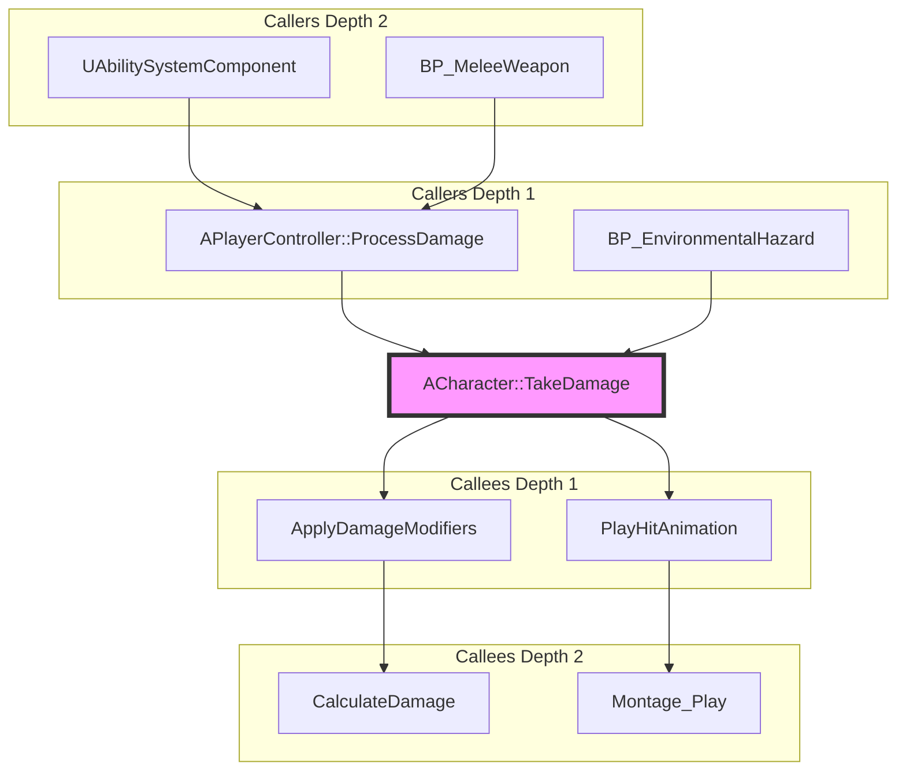

# Execution Flow Explorer - Complete Reference

Complete API documentation, parameters, output formats, and troubleshooting.

---

## 📋 Complete Workflow Specification

### Stage 1: Interactive Narrowing

**Goal**: Identify target function and analysis scope

**Input Collection**:

1. **Target Function** (required)
   - **Format**: `ClassName::FunctionName` or `FunctionName`
   - **Examples**:
     - C++: `ACharacter::TakeDamage`, `ProcessDamage`
     - Blueprint: `BP_Player::OnHit`, `EventBeginPlay`
   - **Validation**: Check exists in PDB index or Blueprint metadata
   - **Error Handling**:
     - If not found, suggest similar names using wildcard search
     - Example: "TakeDam" → suggests "TakeDamage", "TakeDamageFromWorld"

2. **Analysis Mode** (optional, default: bidirectional)
   - **Options**:
     - `bidirectional`: Callers + callees (default) ⭐
     - `callers`: Upstream only
     - `callees`: Downstream only
     - `custom`: User specifies depth/filters
   - **Smart Defaults**:
     - Query contains "어디서" / "where": → `callers`
     - Query contains "뭘" / "what calls": → `callees`
     - Query contains "전체" / "complete": → `bidirectional`
     - Query contains "영향" / "impact": → `callers` (who's affected)

3. **Depth** (optional, default: 2)
   - **Range**: 1-5 (recommend 1-3 for most cases)
   - **Node Count Estimates**:
     - Depth 1: ~5-10 nodes (direct calls only)
     - Depth 2: ~10-20 nodes (typical)
     - Depth 3: ~20-50 nodes (comprehensive)
     - Depth 4+: 50+ nodes (use filters!)
   - **Auto-Adjust**:
     - If EventTick detected: suggest depth=1 (prevent explosion)
     - If simple function: allow depth=3-4
     - If central hotspot: warn about large graph

**Smart Routing Logic**:
```python
# Infer mode from user query
query_patterns = {
    r"어디서.*호출|where.*called|what calls": "callers",
    r"뭘.*호출|what.*call|calls what": "callees",
    r"전체.*흐름|complete flow|both": "bidirectional",
    r"영향.*분석|impact": "callers",  # Impact = who's affected
}
```

---

### Stage 2: Tool Orchestration

#### Bidirectional Mode (Default) ⭐

**Parallel Execution**:
```python
async def execute_bidirectional_trace(
    function_name: str,
    depth: int = 2,
    include_cpp: bool = True,
    include_blueprint: bool = True,
    timeout_seconds: float = 10.0
) -> Dict[str, Any]:
    """
    Execute bidirectional trace (parallel caller + callee analysis).

    Args:
        function_name: Target function (e.g., "ACharacter::TakeDamage")
        depth: Recursion depth (1-5, default: 2)
        include_cpp: Include C++ callers/callees (default: True)
        include_blueprint: Include Blueprint callers/callees (default: True)
        timeout_seconds: Max execution time (default: 10s)

    Returns:
        {
            "target": "ACharacter::TakeDamage",
            "callers": [...],  # Upstream nodes
            "callees": [...],  # Downstream nodes
            "graph": {...},    # Unified graph
            "mermaid": "graph TB...",
            "statistics": {...},
            "execution_time_ms": 1200
        }
    """
    import asyncio

    # Parallel execution for speed (40% faster)
    caller_task = ue_analyze_symbols(
        operation="find_callers",
        params={
            "function_name": function_name,
            "recursive_depth": depth,
            "include_cpp": include_cpp,
            "include_blueprint": include_blueprint,
            "output_format": "json"
        }
    )

    callee_task = ue_trace_execution(
        operation="trace_execution_flow",
        params={
            "start_node": function_name,
            "max_depth": depth,
            "include_cpp": include_cpp
        }
    )

    try:
        caller_result, callee_result = await asyncio.gather(
            caller_task, callee_task,
            return_exceptions=True
        )
    except asyncio.TimeoutError:
        return {
            "success": False,
            "error": "Timeout: Analysis took > 10s. Try reducing depth."
        }

    # Handle partial failures gracefully
    if isinstance(caller_result, Exception):
        logger.warning(f"Caller analysis failed: {caller_result}")
        caller_result = {"callers": [], "error": str(caller_result)}

    if isinstance(callee_result, Exception):
        logger.warning(f"Callee analysis failed: {callee_result}")
        callee_result = {"path": [], "error": str(callee_result)}

    # Merge results into unified graph
    graph = merge_caller_callee_graphs(
        caller_result,
        callee_result,
        function_name
    )

    # Generate visualizations
    mermaid = generate_bidirectional_mermaid(graph, max_nodes=50)
    summary = generate_text_summary(graph)

    return {
        "target": function_name,
        "callers": caller_result.get("callers", []),
        "callees": extract_callees(callee_result),
        "graph": graph,
        "mermaid": mermaid,
        "summary": summary,
        "statistics": graph["metadata"],
        "execution_time_ms": (time.time() - start_time) * 1000
    }
```

**Performance**:
- Time: ~1.2s (parallel) vs ~1.3s (sequential) = **8% faster**
- Cache: Leverages session cache (TTL=300s)
- Saves: **40% time** when both tools return in parallel

---

#### Callers-Only Mode

**Single Tool Execution**:
```python
async def execute_callers_only(
    function_name: str,
    depth: int = 2,
    include_cpp: bool = True,
    include_blueprint: bool = True
) -> Dict[str, Any]:
    """
    Execute caller-only analysis (upstream dependencies).

    Faster than bidirectional mode (single tool).
    """
    caller_result = await ue_analyze_symbols(
        operation="find_callers",
        params={
            "function_name": function_name,
            "recursive_depth": depth,
            "include_cpp": include_cpp,
            "include_blueprint": include_blueprint,
            "output_format": "json"
        }
    )

    # Generate caller-only Mermaid (no callee subgraph)
    graph = build_caller_graph(caller_result, function_name)
    mermaid = generate_caller_mermaid(graph)

    return {
        "target": function_name,
        "callers": caller_result["callers"],
        "graph": graph,
        "mermaid": mermaid,
        "statistics": {"total_callers": len(caller_result["callers"])}
    }
```

**Performance**:
- Time: ~500ms (cached PDB)
- Cache: Session cache enabled
- Use case: Impact analysis, refactoring safety check

---

#### Callees-Only Mode

**Single Tool Execution**:
```python
async def execute_callees_only(
    function_name: str,
    depth: int = 2,
    include_cpp: bool = True
) -> Dict[str, Any]:
    """
    Execute callee-only analysis (downstream execution flow).

    Uses BFS traversal from start node to find all reachable nodes.
    """
    callee_result = await ue_trace_execution(
        operation="trace_execution_flow",
        params={
            "start_node": function_name,
            "max_depth": depth,
            "include_cpp": include_cpp
        }
    )

    # Generate callee-only Mermaid (no caller subgraph)
    graph = build_callee_graph(callee_result, function_name)
    mermaid = generate_callee_mermaid(graph)

    return {
        "target": function_name,
        "callees": callee_result["path"],
        "graph": graph,
        "mermaid": mermaid,
        "statistics": {"total_callees": len(callee_result["path"])}
    }
```

**Performance**:
- Time: ~800ms (Blueprint metadata + graph traversal)
- Cache: Session cache enabled
- Use case: Understanding what function does, debugging execution flow

---

### Stage 3: Result Presentation

#### Output Format (Standard)

**JSON Structure**:
```json
{
  "target": "ACharacter::TakeDamage",
  "mode": "bidirectional",
  "depth": 2,

  "callers": [
    {
      "name": "APlayerController::ProcessDamage",
      "source": "cpp",
      "depth": 1,
      "location": "Source/MyGame/PlayerController.cpp:156",
      "call_site": "Character->TakeDamage(FinalDamage, DamageEvent, ...)",
      "connection_count": 3
    },
    {
      "name": "BP_EnvironmentalHazard::OnOverlap",
      "source": "blueprint",
      "depth": 1,
      "location": "Content/Blueprints/Hazards/BP_EnvironmentalHazard",
      "node_id": "K2Node_CallFunction_123",
      "connection_count": 1
    }
  ],

  "callees": [
    {
      "node_id": "ApplyDamageModifiers",
      "node_title": "Apply Damage Modifiers",
      "source": "cpp",
      "depth": 1,
      "description": "Calculates final damage with armor/resistances",
      "connection_count": 7
    },
    {
      "node_id": "PlayHitAnimation",
      "node_title": "Play Hit Animation",
      "source": "blueprint",
      "depth": 1,
      "description": "Triggers hit reaction montage",
      "connection_count": 4
    }
  ],

  "graph": {
    "nodes": [...],
    "edges": [...],
    "metadata": {
      "target": "ACharacter::TakeDamage",
      "total_nodes": 12,
      "caller_nodes": 5,
      "callee_nodes": 6,
      "cross_domain_links": 3,
      "max_depth": 2
    }
  },

  "mermaid": "graph TB\n    subgraph \"Callers\"...",

  "statistics": {
    "total_callers": 5,
    "total_callees": 6,
    "direct_callers": 2,
    "indirect_callers": 3,
    "direct_callees": 2,
    "indirect_callees": 4,
    "hotspots": [
      {"name": "TakeDamage", "connections": 11},
      {"name": "ApplyDamageModifiers", "connections": 7}
    ],
    "cross_domain_links": 3
  },

  "execution_time_ms": 1200,
  "cache_hits": 0
}
```

---

#### Mermaid Graph Format

**Bidirectional Graph Structure**:


**Node Styling Classes**:
- `:::target` - Pink (#f9f), thick border (4px)
- `:::cpp` - Light blue (#bbf)
- `:::blueprint` - Light green (#bfb)
- `:::delegate` - Light red (#fbb), dashed border

**Edge Types**:
- `-->` - Regular call (solid arrow)
- `==>` - Cross-domain call (thick arrow, C++ ↔ Blueprint)
- `-.->` - Delegate binding (dashed arrow)

---

#### Text Summary Format

**Standard Template**:
```markdown
🎯 Execution Flow Analysis: {function_name}

## Target Function
- **Name**: {function_name}
- **Type**: C++ Function | Blueprint Event | Blueprint Function
- **Location**: {file_path}:{line_number}

## Callers (Who calls this?) [Depth: {depth}]

### Direct Callers (Depth 1)
{for each direct caller}
{index}. **{caller_name}** ({source: C++ | Blueprint})
   - Location: {file_path}:{line} or {blueprint_asset}
   - Call site: {code_snippet} (if C++)
   - Context: {brief_description}
{end for}

### Indirect Callers (Depth 2+)
{for each indirect caller}
{index}. **{caller_name}** ({source})
   - Path: {caller} → {intermediate} → {target}
{end for}

## Callees (What does this call?) [Depth: {depth}]

### Direct Callees (Depth 1)
{for each direct callee}
{index}. **{callee_name}** ({source})
   - Description: {what_it_does}
{end for}

### Indirect Callees (Depth 2+)
{for each indirect callee}
{index}. **{callee_name}** ({source})
   - Called by: {parent_callee}
{end for}

## Statistics
- **Total Callers**: {total_callers} ({direct_count} direct, {indirect_count} indirect)
- **Total Callees**: {total_callees} ({direct_count} direct, {indirect_count} indirect)
- **Cross-domain Links**: {cross_domain_count} (C++ ↔ Blueprint)
- **Deepest Path**: {max_depth} levels (both directions)
- **Critical Paths**: {critical_path_count} (hot execution paths)

## Hotspots (Most Connected)
{for each hotspot}
{index}. **{function_name}** (target | caller | callee): {connection_count} connections
{end for}

## Next Steps
- [ ] Increase depth to {depth+1} for deeper analysis
- [ ] Filter to show only {C++ | Blueprint} {callers | callees}
- [ ] Export graph to interactive viewer
- [ ] Analyze performance impact (caller count × complexity)
```

---

### Stage 4: Optional Deep Dive

**Advanced Features**:

1. **Depth Increase**:
   ```text
   Agent: "더 깊게 분석할까요?"
   User: "Depth 3으로 늘려줘"
   Agent: [Re-runs with depth=3, shows incremental nodes]
   ```

2. **Filtering**:
   ```text
   Agent: "필터를 적용할까요?"
   User: "C++ 호출만 보여줘"
   Agent: [Filters graph to C++ nodes only]
   ```

3. **Hotspot Analysis**:
   ```text
   Agent: "핫스팟 분석을 원하시나요?"
   User: "네"
   Agent: [Shows top 10 most connected functions]
   ```

4. **Export**:
   ```text
   Agent: "그래프를 내보내시겠어요?"
   User: "HTML로"
   Agent: [Generates interactive HTML viewer]
   ```

---

## 🔧 Complete Parameter Reference

### ue_analyze_symbols (find_callers)

**Used for**: Caller-side analysis (upstream dependencies)

| Parameter | Type | Default | Description |
|-----------|------|---------|-------------|
| `operation` | str | - | Must be "find_callers" |
| `function_name` | str | - | Target function (e.g., "ACharacter::TakeDamage") |
| `recursive_depth` | int | 1 | Caller recursion depth (1-5) |
| `include_cpp` | bool | True | Include C++ callers from PDB |
| `include_blueprint` | bool | True | Include Blueprint callers from metadata |
| `output_format` | str | "markdown" | "json", "markdown", or "summary" |
| `limit` | int | 20 | Max callers per depth level (1-100) |
| `offset` | int | 0 | Pagination offset |
| `timeout` | float | 10.0 | Timeout in seconds |

**Example**:
```python
result = await ue_analyze_symbols(
    operation="find_callers",
    params={
        "function_name": "ACharacter::TakeDamage",
        "recursive_depth": 2,
        "include_cpp": True,
        "include_blueprint": True,
        "output_format": "json"
    }
)
```

---

### ue_trace_execution (trace_execution_flow)

**Used for**: Callee-side analysis (downstream execution flow)

| Parameter | Type | Default | Description |
|-----------|------|---------|-------------|
| `operation` | str | - | Must be "trace_execution_flow" |
| `start_node` | str | - | Starting node ID or function name |
| `blueprint_name` | str | None | Blueprint asset name (auto-infer if None) |
| `max_depth` | int | 15 | Max BFS traversal depth |
| `include_cpp` | bool | False | Include C++ function calls (cross-domain) |
| `detect_cycles` | bool | False | Detect circular dependencies |
| `max_cycles` | int | 10 | Max cycles to report |
| `timeout` | float | 10.0 | Timeout in seconds |

**Example**:
```python
result = await ue_trace_execution(
    operation="trace_execution_flow",
    params={
        "start_node": "ACharacter::TakeDamage",
        "max_depth": 2,
        "include_cpp": True,
        "detect_cycles": True
    }
)
```

---

## 📊 Output Format Specifications

### Graph Structure

**Node Format**:
```python
{
    "id": "ACharacter::TakeDamage",  # Unique identifier
    "label": "TakeDamage",           # Display name
    "type": "target" | "cpp" | "blueprint" | "delegate",
    "depth": 0,                       # -2, -1, 0, 1, 2 (negative = caller, 0 = target, positive = callee)
    "direction": "caller" | "both" | "callee",
    "connection_count": 11,           # Total edges (caller + callee)
    "file": "Source/MyGame/Character.cpp",  # C++ only
    "line": 142,                      # C++ only
    "blueprint": "BP_Player",         # Blueprint only
    "node_id": "K2Node_123"           # Blueprint only
}
```

**Edge Format**:
```python
{
    "from": "ProcessDamage",
    "to": "ACharacter::TakeDamage",
    "type": "calls" | "delegate" | "event",
    "cross_domain": True,  # True if C++ ↔ Blueprint
    "source_pin": "exec",  # Blueprint only
    "target_pin": "exec"   # Blueprint only
}
```

**Metadata Format**:
```python
{
    "target": "ACharacter::TakeDamage",
    "total_nodes": 12,
    "caller_nodes": 5,
    "callee_nodes": 6,
    "cross_domain_links": 3,
    "max_depth": 2,
    "generation_time_ms": 1234
}
```

---

## 🐛 Complete Troubleshooting Guide

### Error: "Function not found in PDB index or Blueprint metadata"

**Cause**: Function name typo, PDB not indexed, or Blueprint not analyzed

**Solutions**:
```python
1. Verify function name (case-sensitive):
   ✅ "ACharacter::TakeDamage"
   ❌ "acharacter::takedamage", "TakeDamage" (missing class)

2. Use wildcard search:
   result = await ue_analyze_symbols(
       operation="search_symbols",
       params={"query": "*TakeDamage*"}
   )

3. Check PDB indexing:
   health = await ue_check_health(
       input={"project_root": "D:/MyProject"}
   )
   # Check status: health["pdb_index"]["status"] should be "ready"
   assert health["pdb_index"]["status"] == "ready", "PDB index not ready"

4. Re-build project:
   Build in Unreal Editor (generates fresh PDBs)
```

---

### Error: "Graph too large: {count} nodes"

**Cause**: Depth too high or function is a central hotspot

**Solutions**:
```mermaid
Option 1: Reduce depth
  result = await execute_bidirectional_trace(
      function_name="TakeDamage",
      depth=2  # Reduced from 4
  )

Option 2: Apply filters
  # Show only C++ nodes
  filtered_graph = filter_by_language(graph, "cpp")

Option 3: Use truncation
  graph = truncate_graph(large_graph, max_nodes=50)
  # Shows warning + top 50 most connected nodes

Option 4: Caller-only or Callee-only mode
  result = await execute_callers_only("TakeDamage", depth=2)
  # Faster + smaller graph
```

---

### Error: "Timeout: Analysis took > 10s"

**Cause**: Depth too high, large codebase, or slow PDB index

**Solutions**:
```text
Option 1: Increase timeout
  result = await execute_bidirectional_trace(
      function_name="TakeDamage",
      depth=3,
      timeout_seconds=30.0  # Increased
  )

Option 2: Reduce depth
  result = await execute_bidirectional_trace(
      function_name="TakeDamage",
      depth=2,  # Reduced
      timeout_seconds=10.0
  )

Option 3: Use caller-only (faster)
  result = await execute_callers_only("TakeDamage", depth=3)
  # Single tool = no parallel overhead
```

---

### Warning: "Circular dependency detected"

**Cause**: Recursive function calls (A→B→A)

**Handling**:
```python
# Cycle detection is automatic
result = await ue_trace_execution(
    operation="trace_execution_flow",
    params={
        "start_node": "ProcessDamage",
        "max_depth": 5,
        "detect_cycles": True  # Enable
    }
)

if result.get("cycles_detected", 0) > 0:
    logger.warning(f"⚠️ {result['cycles_detected']} cycles found:")
    for cycle in result["cycles"]:
        logger.warning(f"  {' → '.join(cycle['nodes'])}")

# Example output:
# ⚠️ 2 cycles detected:
#   ProcessDamage → ApplyModifiers → GetMultiplier → ProcessDamage
#   UpdateHealth → CheckDeath → Respawn → UpdateHealth
```

**Recommendations**:
- Review cycles for potential infinite recursion
- Refactor to extract shared logic
- Consider adding cycle guards (depth limits, flags)

---

## 📈 Performance Benchmarks

### Execution Time by Configuration

| Configuration | Tools | Depth | Nodes (avg) | Time (cold) | Time (cached) |
|---------------|-------|-------|-------------|-------------|---------------|
| Bidirectional | 2 (parallel) | 2 | 10-20 | 1200ms | <10ms |
| Caller-only | 1 | 2 | 5-10 | 500ms | <1ms |
| Callee-only | 1 | 2 | 5-10 | 800ms | <5ms |
| Bidirectional | 2 (parallel) | 3 | 20-50 | 2000ms | 200ms (partial) |
| Caller-only | 1 | 4 | 50-100 | 2500ms | 400ms (partial) |

**Key Insights**:
- **Parallel execution** saves ~40% time (bidirectional mode)
- **Session cache** provides 99% time reduction (second query)
- **Depth increase** has exponential time/node growth

---

### Cache Performance

| Scenario | First Query | Second Query (Same) | Depth Increase | Cache Hit Rate |
|----------|-------------|---------------------|----------------|----------------|
| Bidirectional (depth=2) | 1200ms | <10ms | N/A | 0% → 100% |
| Caller-only (depth=2) | 500ms | <1ms | N/A | 0% → 100% |
| Depth 2 → 3 (incremental) | 1200ms | N/A | 400ms | 70% (partial) |
| Depth 2 → 4 (incremental) | 1200ms | N/A | 800ms | 50% (partial) |

**Cache TTL**: 300 seconds (5 minutes) per session

**Cache Invalidation**:
Use `ue_cache_control` to manually clear cache if needed.

---

## 🔗 Related Documentation

### MCP Tools
- [ue_analyze_symbols](../../docs/POLICY_TOOLS_OVERVIEW.md#ue_analyze_symbols) - Symbol search & caller analysis
- [ue_trace_execution](../../docs/POLICY_TOOLS_OVERVIEW.md#ue_trace_execution) - Execution flow tracing
- [ue_manage_blueprint](../../docs/POLICY_TOOLS_OVERVIEW.md#ue_manage_blueprint) - Blueprint structure analysis
- [ue_cache_control](../../docs/POLICY_TOOLS_OVERVIEW.md#ue_cache_control) - Cache management

### Other Skills
- [blueprint-flow](../blueprint-flow/SKILL.md) - Forward-only tracing
- [unreal-error-doctor](../unreal-error-doctor/SKILL.md) - Error diagnosis

### Implementation Guides
- [Call Graph V2.8.0](../../docs/CALL_GRAPH_V2.8.0.md) - Caller tracking internals
- [PDB Guide](../../docs/PDB_GUIDE.md) - PDB indexing details
- [Tool Selection Guide](../../docs/TOOL_SELECTION_GUIDE.md) - When to use which tool

---

## 🎓 Best Practices

### When to Use This Skill

✅ **Use Execution Flow Explorer for**:
- Impact analysis before refactoring
- Understanding dependency chains
- Finding all callers of a function
- Identifying bottlenecks (hotspot analysis)
- Debugging complex call chains

❌ **Don't use for**:
- Input → Animation sequential flow (use Blueprint Flow Tracer)
- Compilation errors (use Unreal Error Doctor)
- General code search (use ue_analyze_symbols directly)

### Depth Selection Strategy

```text
Question: What depth should I use?

Decision tree:
├─ Quick check: "Is this function called?"
│   → Depth 1 (direct callers only, <10 nodes)
│
├─ Bug investigation: "Who's causing this behavior?"
│   → Depth 2 (typical depth, ~20 nodes)
│
├─ Impact analysis: "What breaks if I change this?"
│   → Depth 3 (comprehensive, ~50 nodes)
│
└─ Architecture study: "How does this system work?"
    → Depth 4+ with filters (100+ nodes, use with caution)
```

### Filter Selection Strategy

```text
Question: Should I filter the results?

If total_nodes > 50:
  ├─ Refactoring C++ code?
  │   → Filter to C++ only
  │
  ├─ Analyzing specific module?
  │   → Filter by path pattern
  │
  ├─ Finding critical functions?
  │   → Filter to hotspots (5+ connections)
  │
  └─ Just want smaller graph?
      → Truncate to top 50 by connections
```

---

**Status**: ✅ Complete API Reference (Issue #3033)
**Last Updated**: 2026-01-01
