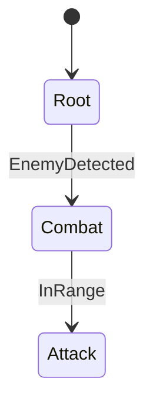
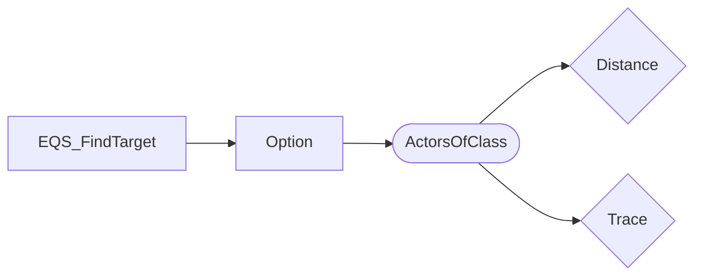

# Game Design Intelligence - Examples

## Example 1: Full Balance Analysis

**User**: "프로젝트 GAS 밸런스 분석해줘"

### Step 1: System Overview
```text
ue_manage_gameplay(operation="analyze_gameplay_system")
```
→ Get counts: 42 effects, 18 abilities, 156 tags

### Step 2: Balance Report
```text
ue_manage_gameplay(operation="generate_balance_report", output_format="markdown")
```
→ Attribute impact matrix, warnings, ability-effect map

### Output
- Markdown with tables: duration type breakdown, attribute impacts
- Warnings: infinite+no stacking, SetByCaller dynamic values
- CurveTable cross-references

---

## Example 2: AI Behavior Documentation

**User**: "ST_EnemyAI와 BT_Combat 문서 생성해줘"

### Step 1: StateTree Doc
```text
ue_manage_ai(ai_type="statetree", operation="generate_doc", asset_name="ST_EnemyAI")
```
→ Mermaid stateDiagram-v2 + state detail table

### Step 2: BehaviorTree Doc
```text
ue_manage_ai(ai_type="behaviortree", operation="generate_doc", asset_name="BT_Combat")
```
→ Mermaid graph TD + node detail table

### Output


---

## Example 3: EQS Query Documentation

**User**: "EQS_FindTarget 쿼리 문서화해줘"

```text
ue_manage_ai(ai_type="eqs", operation="generate_doc", asset_name="EQS_FindTarget")
```

### Output


Plus scoring detail table with test purpose, filter, weight.

---

## Example 4: Filtered Balance Report

**User**: "Damage 관련 이펙트만 밸런스 분석해줘"

```text
ue_manage_gameplay(operation="generate_balance_report", filter="*Damage*", output_format="markdown")
```

→ Only effects matching `*Damage*` pattern included in report.

---

## Example 5: Combined Design Document

**User**: "전체 게임 디자인 문서 만들어줘"

### Full Workflow
1. `ue_manage_gameplay(operation="analyze_gameplay_system")` → overview
2. `ue_manage_gameplay(operation="generate_balance_report")` → balance
3. `ue_manage_ai(ai_type="statetree", operation="list_assets")` → discover ST assets
4. For each ST: `ue_manage_ai(operation="generate_doc", asset_name="ST_*")` → diagrams
5. `ue_manage_ai(ai_type="behaviortree", operation="list_assets")` → discover BT assets
6. For each BT: `ue_manage_ai(operation="generate_doc", asset_name="BT_*")` → diagrams
7. Combine all into unified document
