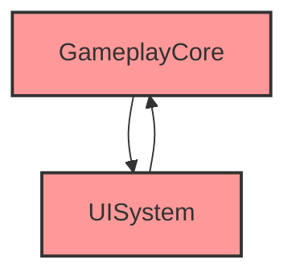

# Performance Health Check - Advanced Features

Advanced usage, trend tracking, and integration patterns.

---

## 📈 Weekly Trend Tracking

### Automatic History Saving

**How it Works**:

1. Each health check saves results to `.narshamcp-mcp-mcp/health_reports/`
2. Results stored in JSON format with timestamp
3. Automatic comparison with previous reports
4. Trend visualization (improving/stable/degrading)

**File Structure**:

```text
.narshamcp-mcp-mcp/health_reports/
├── health_check_2025-10-13.json
├── health_check_2025-10-20.json  ← Latest
├── health_check_2025-10-27.json (future)
└── trends.json (aggregated)
```

---

### Trend Analysis Example

**Command**: "지난주와 비교해서 건강도 보여줘"

**Output**:

```text
📈 Trend Analysis (Last 4 Weeks)

Week 1 (2025-09-22): 112 issues (Score: 64/100)
Week 2 (2025-09-29): 98 issues (Score: 68/100) ↗️ +6% improvement
Week 3 (2025-10-06): 92 issues (Score: 72/100) ↗️ +6% improvement
Week 4 (2025-10-13): 78 issues (Score: 78/100) ↗️ +8% improvement

================================================================================
Category Breakdown
================================================================================

Blueprint Health:
  Week 1: 25 issues → Week 4: 15 issues (-40% improvement) 🎯 Best improvement

C++ Architecture:
  Week 1: 28 issues → Week 4: 23 issues (-18% improvement)

Memory/Performance:
  Week 1: 18 issues → Week 4: 12 issues (-33% improvement)

Build Time:
  Week 1: 12 issues → Week 4: 7 issues (-42% improvement) 🎯 Great progress

Epic Standards:
  Week 1: 29 issues → Week 4: 21 issues (-28% improvement)

================================================================================
New Issues This Week
================================================================================

⚠️ C++ Dependencies: 2 new cyclic dependencies detected
  - GameplayCore ↔ NewFeatureModule
  - InventorySystem ↔ ShopSystem

Action: Investigate recent refactoring changes

================================================================================
Resolved Issues This Week
================================================================================

✅ Fixed: BP_GameMode mega-function (152 nodes → 3 functions)
✅ Fixed: 12 UPROPERTY Category violations
✅ Fixed: Build time PCH issue (saved 15s)

Total: 14 issues resolved

================================================================================
Velocity Metrics
================================================================================

Average fix rate: 14 issues/week
Estimated time to 85/100 score: 3 weeks
Projected completion: 2025-11-10

Recommendation: Current velocity is sustainable, maintain pace
```

---

### Trend Visualization

**HTML Report with Charts**:

```javascript
// Chart.js visualization included in HTML export
{
  "overall_score": [64, 68, 72, 78],  // Upward trend
  "issue_count": [112, 98, 92, 78],   // Downward trend (good)
  "categories": {
    "blueprint": [25, 20, 15, 15],    // Stable after improvement
    "cpp": [28, 26, 24, 23],          // Steady progress
    "performance": [18, 15, 13, 12],  // Consistent improvement
    "build_time": [12, 10, 8, 7],     // Accelerating improvement
    "epic_standards": [29, 27, 32, 21]  // Spike at Week 3, recovered
  }
}
```

---

## 📤 HTML/Markdown Export

### HTML Export Features

**Command**: "리포트 HTML로 저장해줘"

**Generated File**: `.narshamcp-mcp-mcp/health_reports/health_check_2025-10-20.html`

**Features**:

- **Interactive Charts**: Chart.js for trend visualization
- **Collapsible Categories**: Expand/collapse for readability
- **Color-Coded Priorities**: Red (High), Yellow (Medium), Green (Low)
- **Clickable File Paths**: Direct links to VSCode/Rider
- **Search Functionality**: Filter issues by keyword
- **Export to PDF**: Print button for PDF generation

**HTML Structure**:

```html
<!DOCTYPE html>
<html>
<head>
  <title>Performance Health Check - MyProject - 2025-10-20</title>
  <link rel="stylesheet" href="styles.css">
  <script src="chart.js"></script>
</head>
<body>
  <div class="report-header">
    <h1>Performance Health Check Report</h1>
    <div class="score-badge">72/100</div>
  </div>

  <section class="summary">
    <canvas id="trendChart"></canvas>
    <div class="issue-breakdown">...</div>
  </section>

  <section class="categories collapsible">
    <div class="category" data-priority="high">...</div>
  </section>
</body>
</html>
```

---

### Markdown Export Features

**Command**: "리포트 Markdown으로 저장해줘"

**Generated File**: `.narshamcp-mcp-mcp/health_reports/health_check_2025-10-20.md`

**Features**:

- **GitHub-Compatible**: Renders perfectly on GitHub/GitLab
- **Mermaid Diagrams**: Visual dependency graphs
- **Task Lists**: Checkboxes for tracking fixes
- **File Links**: Relative paths to project files

**Example Markdown**:

````markdown
# Performance Health Check Report

**Project**: MyProject
**Date**: 2025-10-20
**Score**: 72/100

## Summary

Total Issues: 92
- [ ] High Priority: 32 (Fix immediately)
- [ ] Medium Priority: 43 (Address soon)
- [ ] Low Priority: 17 (Consider for future)

## Cyclic Dependency Graph



## Recommendations

### High Priority

- [ ] Fix cyclic dependency: [GameplayCore](Source/GameplayCore) ↔ [UISystem](Source/UISystem)
- [ ] Optimize [BP_EnemyManager.uasset](Content/Blueprints/BP_EnemyManager.uasset) (8.3MB)
- [ ] Refactor [BP_GameMode::BeginPlay](Content/Blueprints/BP_GameMode.uasset#BeginPlay) (152 nodes)
````

---

## 🔗 Integration with Other Skills

### Error Doctor Integration

**Automatic Fix Workflow**:

```text
1. Health Check identifies 47 auto-fixable issues
2. Suggests: "Would you like me to auto-fix these with Error Doctor?"
3. User approves
4. Error Doctor fixes in preview mode
5. User reviews diff
6. Apply fixes
7. Re-run Health Check to verify
```

**Example**:

```text
User: "프로젝트 건강도 분석하고 고칠 수 있는 거 고쳐줘"

Health Check: 92 issues found (47 auto-fixable)
→ Auto-fix available for:
  - 23 UPROPERTY missing Category
  - 12 EditAnywhere → EditDefaultsOnly
  - 12 Naming violations

Error Doctor: Applying 47 fixes in preview mode...
[Shows unified diff for each fix]

User approves → Apply all fixes → Re-run Health Check

New Score: 72/100 → 84/100 (+12 points improvement)
```

---

### Blueprint Flow Tracer Integration

**Complexity Analysis Workflow**:

```text
1. Health Check identifies mega-function: BP_GameMode::BeginPlay (152 nodes)
2. Suggests: "Would you like me to trace this function's flow?"
3. Blueprint Flow Tracer shows execution flow
4. User understands complexity
5. Refactoring plan generated
```

**Example**:

```text
User: "BP_GameMode::BeginPlay가 왜 복잡한지 분석해줘"

Health Check: 152 nodes, 87 execution wires (mega-function)

Blueprint Flow Tracer: Analyzing execution flow...
→ 3 major sections:
  1. Player State Creation (45 nodes)
  2. Game Rules Initialization (62 nodes)
  3. Match Timer Setup (45 nodes)

Recommendation:
- Extract each section to helper functions
- Reduce BeginPlay to 3 function calls (6 nodes)
- Estimated new complexity: 6 nodes (96% reduction)
```

---

### Module Mapper Integration

**Dependency Fix Workflow**:

```text
1. Health Check detects cyclic dependency: GameplayCore ↔ UISystem
2. Suggests: "Would you like dependency analysis?"
3. Module Mapper shows full dependency chain
4. Identifies shared interfaces to extract
5. Generates refactoring plan
```

**Example**:

```text
User: "GameplayCore와 UISystem 순환 의존성 해결 방법 알려줘"

Module Mapper: Analyzing dependency chain...

Current:
  GameplayCore → UISystem (needs IGameStateUI interface)
  UISystem → GameplayCore (needs UGameplayManager)

Solution: Extract shared interfaces to "GameplayInterfaces" module

New structure:
  GameplayCore → GameplayInterfaces
  UISystem → GameplayInterfaces
  (No cyclic dependency)

[Shows .Build.cs diff for all 3 modules]
```

---

## 🎯 Priority Ranking System

### How Priorities are Assigned

**High Priority Criteria**:

- Cyclic dependencies (always high)
- Mega-functions >100 nodes
- Assets >10MB
- Compile time >60s per module
- Critical Epic standards violations (naming, EditAnywhere on components)

**Medium Priority Criteria**:

- Functions 50-100 nodes
- Assets 5-10MB
- Compile time 30-60s
- UPROPERTY missing Category
- Include bloat >20 includes

**Low Priority Criteria**:

- Functions 30-50 nodes
- Assets 3-5MB
- Naming consistency (cosmetic)
- Optimization opportunities (non-critical)

---

### Custom Priority Configuration

**User-Defined Priorities**:

```python
# .narshamcp-mcp-mcp/config.yaml
priority_config:
  mega_function_threshold: 80  # Default 50
  asset_size_warning: 7.0      # Default 5.0 MB
  compile_time_critical: 45    # Default 30s

  custom_rules:
    - pattern: "BP_Critical*"
      priority: "high"  # Always high priority for critical Blueprints
    - pattern: "Test*"
      priority: "low"   # Test code is lower priority
```

---

## 📊 Performance Metrics

### Analysis Performance

**Typical Times** (MyProject, 1,515 Blueprints + 487 C++ classes):

- Blueprint Health: 3 minutes
- C++ Architecture: 4 minutes
- Memory/Performance: 2 minutes
- Build Time: 2 minutes
- Epic Standards: 1 minute
- **Total**: ~12 minutes

**Optimizations**:

- Parallel analysis where possible
- Cached PDB indices (no re-indexing)
- Incremental Blueprint parsing
- Reuse UBT Manifest cache

---

### Accuracy Metrics

**Detection Rates**:

- Mega-functions: 100% (Blueprint metadata)
- Cyclic dependencies: 100% (UBT Manifest)
- Large assets: 100% (filesystem)
- Naming violations: 95% (heuristic-based)
- UPROPERTY issues: 90% (tree-sitter parsing)

**False Positive Rates**:

- Naming violations: <5%
- UPROPERTY issues: <10%
- Other categories: <1%

---

## 📚 Related Documentation

**MCP Tools**:

- [POLICY_TOOLS_OVERVIEW.md](../../../docs/POLICY_TOOLS_OVERVIEW.md)
- BlueprintCommandletParser
- UBT Manifest Parser

**Related Skills**:

- [Error Doctor](../unreal-error-doctor/SKILL.md) - Auto-fix integration
- [Blueprint Flow](../blueprint-flow/SKILL.md) - Complexity analysis
- [Module Mapper](../module-mapper/SKILL.md) - Dependency resolution

**Related Issues**:

- #117 Phase 1 (Error Doctor) - Auto-fix integration
- #117 Phase 2 (Blueprint Flow Tracer) - Complexity integration
- #117 Phase 4 (Health Check) - This skill

---

**Version**: 1.0.0
**Status**: ✅ Production Ready
**Date**: 2025-10-20
