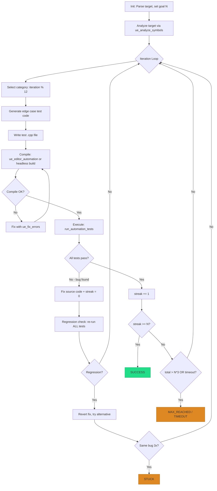

# UE Test Iterate

**Version**: 1.0.0
**Priority**: High
**Goal**: N consecutive clean passes of UE Automation Tests via 12-category edge case rotation
**Issue**: #6731

---

## Purpose

Generate **UE Automation Tests** covering 12 edge case categories in rotation, execute them, and fix discovered bugs — repeating until **N consecutive clean passes** are achieved.

**Key Benefits**: 12-category rotation catches manual blind spots. Auto-fix with regression guard. Streak-based completion guarantees sustained stability.

**Expected iteration times** (from design scenarios):

| Scenario | Target | Typical Time |
|----------|--------|-------------|
| Single function, 3 passes | Easy | ~2 min |
| Class-wide, 10 passes | Normal | ~15 min |
| GAS ability flow, 5 passes | Hard | ~12 min |
| Full 12-category, 10 passes | Expert | ~25 min |

Manual edge case testing typically takes 2-4 hours per class. This skill targets equivalent coverage in 15-30 minutes. Test types: `simple`, `bdd_spec` (default), `complex_latent`, `functional` — see [REFERENCE.md](REFERENCE.md).

---

## Activation Triggers

### Auto-Trigger Keywords
**Korean**: "UE 테스트 반복", "UE 엣지 케이스", "자동화 테스트 반복", "클린 패스까지 테스트", "엣지 케이스 찾아줘"
**English**: "UE test iterate", "UE edge case test", "automation test iterate", "clean passes"

### Manual Invocation
```bash
/ue-test-iterate CalculateDamage 3              # Easy: 3 clean passes
/ue-test-iterate AMyCharacter 10                # Normal: class-wide
/ue-test-iterate GA_Attack --clean-passes 5     # Hard: GAS ability
/ue-test-iterate AMyCharacter --headless        # No Editor required
```

### Activation Test Cases

**Should Activate** (6):
- "UE 테스트 반복 10번 돌려줘" → ue-test-iterate
- "UE edge case test on AMyCharacter" → ue-test-iterate
- "automation test iterate GA_Attack" → ue-test-iterate
- "TakeDamage 엣지 케이스 찾아줘" → ue-test-iterate
- "5 clean passes for CalculateDamage" → ue-test-iterate
- "AMyCharacter --headless 테스트 반복" → ue-test-iterate

**Should NOT Activate** (4):
- "테스트 생성해줘" → `/ue-test-gen` (one-shot generation, not iteration)
- "자동화 테스트 6단계로 만들어줘" → `/ue-automation-test-builder` skill (interactive 6-phase cycle)
- "빌드 에러 고쳐줘" → `/ue-debug` (different domain)
- "테스트 실패 분석해줘" → `/ue-debug` (failure analysis, not edge case iteration)

**Ambiguous** (2): see [REFERENCE.md](REFERENCE.md)

---

## Workflow



### Per-Iteration Detail (4 Phases)

1. **Analyze** — Select category via `iteration % 12`. Study target signatures using `ue_analyze_symbols(get_methods)` and `ue_grep`.

2. **Generate** — Scaffold test via `ue_generate_code(generate_test)`, then write custom edge case values in C++. Output to `Source/<Module>/Tests/`. Ensure `Build.cs` includes `"AutomationController"` dependency.

3. **Execute** — Compile and run:
   - **Editor mode** (default): `ue_editor_automation(run_automation_tests, test_name="<TestPath>")`
   - **Headless mode** (`--headless`): `ue_build_pipeline(run_commandlet, commandlet_name="AutomationTest", commandlet_args=["-test=<TestPath>"])`

4. **Evaluate** — Parse results:
   - All pass → increment streak counter
   - Any fail → analyze failure, fix source code, reset streak to 0, run regression check

**Detailed algorithm + pseudocode**: [REFERENCE.md](REFERENCE.md)

### 12 Edge Case Categories

Boundary Values, Null/Empty, Type Boundaries, Unicode/Encoding, Large Inputs, Concurrent Access, Error Paths, Overflow/Underflow, State Transitions, Format Variations, Resource Exhaustion, Regression Guards.

Category = `iteration % 12`. Each revisit uses different values. **Full table with UE-specific examples**: [REFERENCE.md](REFERENCE.md).

---

## Configuration

| Argument | Default | Description |
|----------|---------|-------------|
| `$ARGUMENTS[0]` | (required) | Target: class, `Class::Function`, or test path |
| `$ARGUMENTS[1]` or `--clean-passes N` | 5 | Consecutive clean passes needed (max: 50) |
| `--type` | `bdd_spec` | `simple`, `bdd_spec`, `complex_latent`, `functional` |
| `--categories` | auto-rotate | e.g. `boundary,null,unicode` or `all` |
| `--headless` | false | Commandlet mode (no Editor) |
| `--timeout` | `30m` | Wall clock limit |

**Max iterations**: `N * 3` (safety cap).

---

## Exit Conditions

| Condition | Trigger |
|-----------|---------|
| **SUCCESS** | `streak >= N` |
| **MAX REACHED** | `total_iterations > N * 3` |
| **TIMEOUT** | Wall clock exceeds `--timeout` |
| **STUCK** | Same bug found 3 consecutive times |
| **REGRESSION** | Fix breaks existing tests, revert fails |

---

## Safety

- **Git branch required** — All modifications revertible via `git checkout`
- **Regression guard** — Every fix triggers full test suite re-run
- **Stuck exit** — Same bug 3 times → auto-stop
- **Auto-revert on regression** — Fix breaks existing tests → revert immediately
- **Build.cs check** — Verify `AutomationController` dependency before generating tests

---

## MCP Tools Used

| Tool | Purpose |
|------|---------|
| `ue_analyze_symbols` | Discover methods, signatures, parameter types |
| `ue_generate_code(generate_test)` | Template scaffolding; custom C++ for edge values |
| `ue_editor_automation(run_automation_tests)` | Execute tests + parse results (Editor) |
| `ue_build_pipeline(run_commandlet)` | Execute tests headless |
| `ue_fix_errors` | Auto-resolve compilation errors |
| `ue_grep` / `ue_read` | Source code analysis |

---

## Quick Examples

```bash
/ue-test-iterate CalculateDamage 3
# [Iter 1] CLEAN  boundary_values    (3 tests, streak: 1/3)
# [Iter 2] CLEAN  null_empty         (3 tests, streak: 2/3)
# [Iter 3] CLEAN  type_boundaries    (3 tests, streak: 3/3)
# SUCCESS: 3/3 clean passes, 9 edge cases, 0 bugs

/ue-test-iterate AMyCharacter 10
# [Iter 2] BUG null_empty → Fix: nullptr check in TakeDamage()
# [Iter 14] SUCCESS: 10/10 clean passes, 1 bug fixed, 52 edge cases
```

**Full examples**: [EXAMPLES.md](EXAMPLES.md) | **Output format + Error recovery**: [REFERENCE.md](REFERENCE.md)
